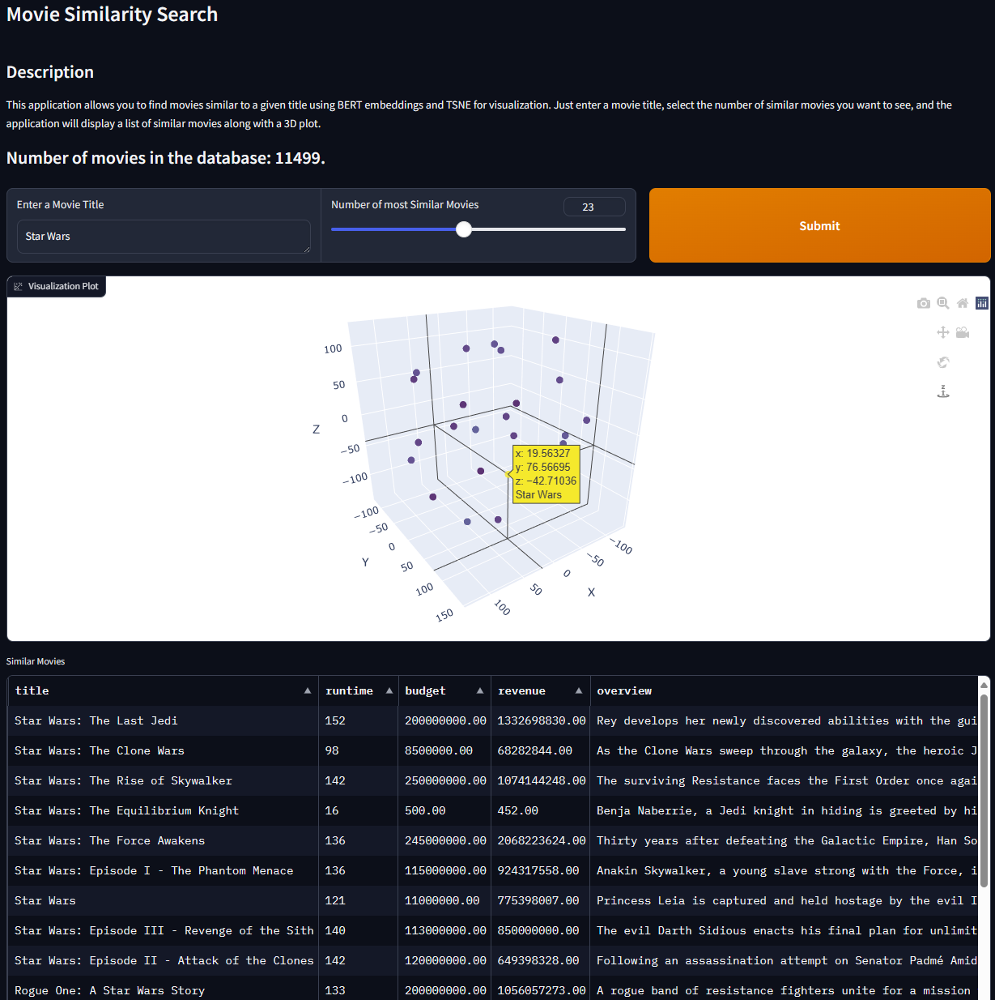

# VectorDB

This repository contains the code for my presentation about vector databases. The presentation uses the Redis stack.



## Prerequisites
- Docker
- Python >=3.8 or Rust >=1.5
- Running Redis container (see setup.bash)

## How to run
1. Start the Redis container
```bash
./setup.bash
```
2. Run the Python example
```bash
cd python
pip install -r requirements.txt
python3 01_data_upload.py
```
or any other example by changing the name.

2. The rust examples

```bash
cd rust
cargo run --bin 01_data_upload
```
or any other example by changing the name.
For the rust examples you also need to create the index manually. You can do this by running the corresponding python script.

### Running embeddings locally
To run the embeddings locally, you need to download the model first from huggingface. You can do this by running the following command:
```bash
git clone https://huggingface.co/sentence-transformers/bert-base-nli-mean-tokens
```


# Where does the data come from?
The data is from the [The Movie Database](https://www.themoviedb.org/?language=de) dataset. It is a collection of food products from around the world. The data is licensed under the Open Database License. The data was downloaded for a university project in [MovieVerse](https://github.com/ConnActivity/MovieVerse).